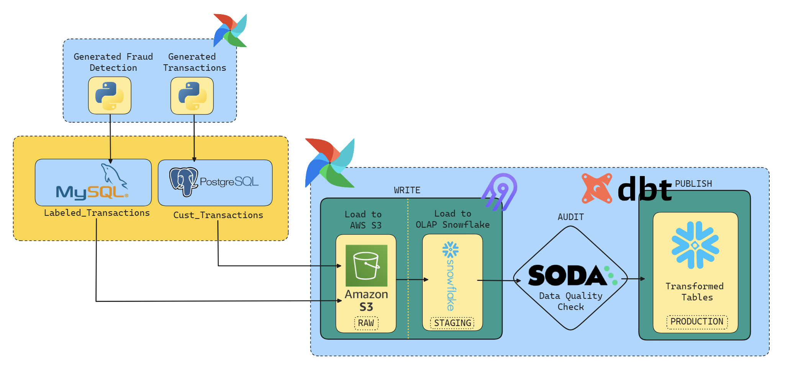

### Project ETL Fraud

> End-to-end data pipeline with write-audit-publish (WAP) pattern

- **Data Stack**
  - Orchestration = Apache Airlow
  - Connector = Airbyte
  - Data Transformation = dbt
  - Data Quality Platform = Soda
  - Database = Postgre & MySQL & AWS S3
  - OLAP/Data Warehouse = Snowflake

#### A. System Design

#### B. Airflow Graph

#### C. Data Quality Check

#### D. Snowflake Data Warehouse
